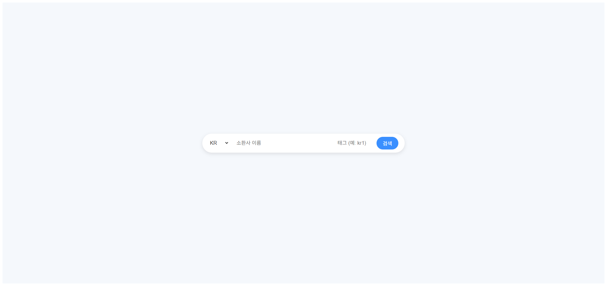

# OP.GG Clone

  

소환사 이름과 태그 입력 한 줄로 랭크 조회 → 최근 20게임 전적 → 아군/적군 팀 상세까지 확인하는 OP.GG 클론.

<p align="center">
  
</p>

## 빠른 시작

```bash
npm install

# 환경변수 설정
echo "RIOT_API_KEY=your_api_key_here" > server/.env

npm run server   # 서버 (port 8080)
npm run client   # 클라이언트 (port 3000)
```

Riot API 키 발급 → [Riot Developer Portal](https://developer.riotgames.com)

## 라이선스

MIT
